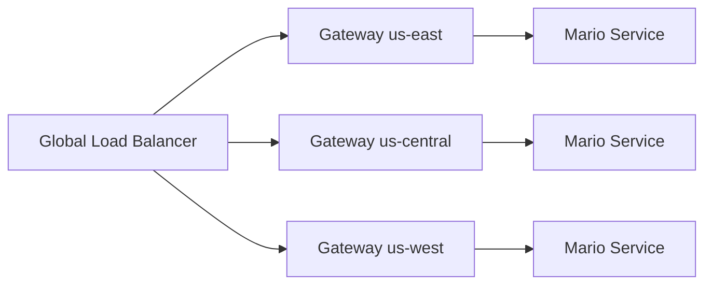

# Kubernetes Module for Multi-Cluster Mario Deployment

This module deploys the Super Mario browser game across GKE clusters using Gateway API and multi-cluster service discovery.

## Architecture



## Features

- Gateway API integration for global load balancing
- Multi-cluster service discovery
- Horizontal Pod Autoscaling (HPA)
- Readiness probes and health checks
- Resource limits and requests
- Non-root container security context

## Usage

```hcl
module "k8s_mario" {
  source = "./modules/k8s"

  project_id       = "my-project"
  cluster_name     = "central-cluster"
  cluster_location = "us-central1-c"
  cluster_endpoint = "https://35.x.x.x"
  cluster_ca_cert  = "base64_encoded_cert"
  config_cluster   = true  # Enable Gateway config on this cluster

  image         = "sevenajay/mario:latest"
  min_replicas  = 1
  max_replicas  = 5
}
```

## Requirements

- Terraform ~> 1.11
- GKE cluster with Gateway API enabled
- Following APIs enabled:
  - container.googleapis.com
  - gkehub.googleapis.com
  - multiclusterservicediscovery.googleapis.com
  - multiclusteringress.googleapis.com

## Variables

| Name             | Description                  | Type   | Required |
| ---------------- | ---------------------------- | ------ | :------: |
| project_id       | GCP Project ID               | string |   yes    |
| cluster_name     | GKE cluster name             | string |   yes    |
| cluster_location | GKE cluster location         | string |   yes    |
| cluster_endpoint | GKE cluster endpoint         | string |   yes    |
| cluster_ca_cert  | GKE cluster CA certificate   | string |   yes    |
| config_cluster   | Enable Gateway configuration | bool   |   yes    |
| image            | Mario container image        | string |   yes    |
| min_replicas     | Minimum pod replicas         | number |    no    |
| max_replicas     | Maximum pod replicas         | number |    no    |

## Resource Configurations

### Pod Resources

```yaml
resources:
  limits:
    cpu: 500m
    memory: 1000Mi
  requests:
    cpu: 250m
    memory: 512Mi
```

### HPA Settings

```yaml
autoscaling:
  cpuUtilization: 75
  scaleUpStabilization: 60s
  scaleDownStabilization: 300s
```

## Monitoring

Monitor deployment health:

```bash
# Check Gateway status
kubectl get gateway -n mario

# View service discovery
kubectl get serviceimport -n mario

# Monitor pod scaling
kubectl get hpa -n mario
```

## Troubleshooting

1. Gateway Issues

```bash
# Check Gateway status
kubectl describe gateway mario-external-gateway -n mario

# View Gateway events
kubectl get events -n mario --field-selector involvedObject.kind=Gateway
```

2. Service Discovery Issues

```bash
# Verify ServiceExport
kubectl describe serviceexport mario-service -n mario

# Check ServiceImport status
kubectl get serviceimport mario-service -n mario -o yaml
```

3. Pod Issues

```bash
# Get pod logs
kubectl logs -l app=mario -n mario

# Check pod events
kubectl get events -n mario --field-selector involvedObject.kind=Pod
```

## Limitations

- Gateway API must be enabled on all clusters
- Clusters must be registered to the same fleet
- Only HTTP traffic is supported
- Load balancer provisioning takes ~5 minutes

## Outputs

| Name             | Description             |
| ---------------- | ----------------------- |
| load_balancer_ip | Global load balancer IP |

## Security

- Non-root container execution
- No privilege escalation
- Resource limits enforced
- Network policy ready

## License

This module is licensed under the GNU General Public License v3.0
